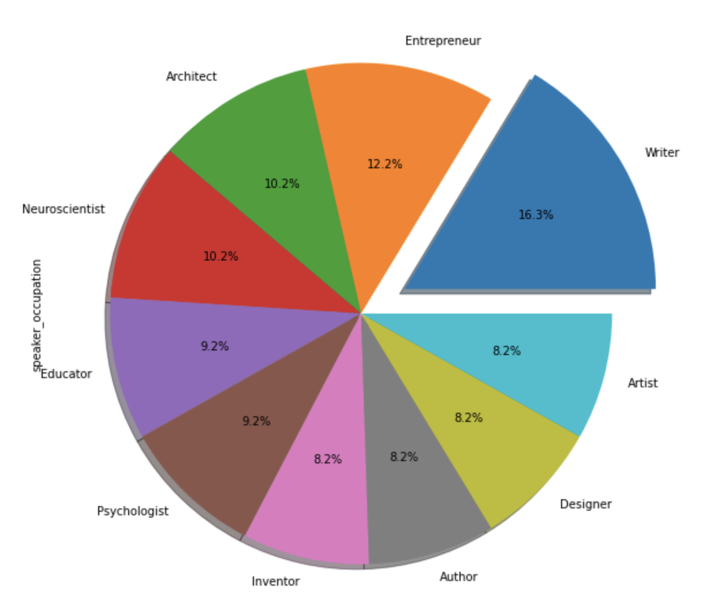

# What Ideas are Worth Spreading?: TED Talk Popularity Explained by Data

***

## Introduction
Almost everyone has watched at least one TED Talk. According to the TED blog, in 2012, TED talks were being viewed at a rate of 1.5 million times a day, and TED surpassed one billion video views[1]. It is not surprising that TED talks are so widely popular as they are free videos from industry experts that are available anytime, anywhere. Since I was young, I was fascinated by the ideas presented in the talks, and they inspired me to learn. Looking back, I watched TED Talks that were widespread and viral on social media platforms, namely Youtube and Facebook. I have seen many of the most viral TED Talks but there are hundreds I have never seen which caused me to wonder why some ideas presented in TED Talks spread to a viral audience while others do not. To delve further into TED Talk popularity, I analyzed the 'TED Talks' dataset which was extracted from TED.com by Rounak Banik and is available at https://www.kaggle.com/rounakbanik/ted-talks. 

 

***

## Discussion
I have a question for you, what causes a TED talk to be popular? You may have thought of the speaker already having a large audience, an interesting topic or the amount of engagement in the comments. When I started investigating this question, I thought of views and comment engagement. I thought if I found the TED talks with the most viewers and comments, I would find the most popular TED talks but I was wrong. 

So let me explain, I found a playlist constructed by TED called "The most popular talks of all time" [1]. The playlist included numerous TED talks that had gone viral and I considered them popular. So I chose to use the minimum number of views and comments from the playlist to define popularity. I calculated that a talk needed around 2 million views and 171 comments to be classified as popular. When I evaluated the popularity definition, I discovered the correlation between the attributes of all the TED talk data was stronger than the popular TED talk data. I think I measured how long the talk was published more than I measured popularity. A talk from 2016 could be popular and interesting but it may not have the same level of engagement as a talk that had been published for a decade.

| | |
|:------------------------------------|:----------------------------------|
| _Section 3: Task 3 Graph using All TED Talk Data_ | _Section 3: Task 3 Graph using Popular Classification based on playlist_ |
 

In the pursuit of TED talk popularity, it was back to the drawing board to discover another idea that would be more successful. The Cambridge Dictionary defines popularity as "liked, enjoyed, or supported by many people" [2]. I had found TED talks that had been seen by many people but how could I assess if the people liked or enjoyed the talk? The ratings, eureka! The 'ratings' column provided a count of the number of people who rated a talk funny, inspiring, longwinded, confusing or something else. I categorized each of the 14 ratings as a popular or unpopular rating by if the rating was positive or negative. If I enjoyed a talk, I am more likely to rate it fascinating rather than obnoxious. A ratio between popular and unpopular rating counts was born and I had a measure of how much viewers liked or disliked a talk. My new definition of popularity was if a talk had a popularity ratio greater than 10 and it had over 1 million views, I classified it as popular. 

||
|---------------------------------|
_Section 6: Task 3 Graph using Popular Classification based on ratings and views_
 

My new strategy using ratings and views to classify popularity showed a much stronger relationship between attributes. An interesting finding is that views, comments and languages have a moderate to strong relationship to many attributes except for duration and number of speakers. Both the number of speakers and duration columns have little relationship with other attributes. To me, this is reasonable as I don't think how long a TED talk is or how many presenters there are would have as big of an impact on TED talk popularity compared to other attributes. 

With the talks classified as popular or unpopular, it was finally time to delve further into TED talk popularity. I started by visualizing the number of popular TED talks published per month and weekday.  

||
|-----------------------------------|
_Section 8: Task 2 Graph showing month and day popular TED talks are published_
 

The insights I discovered from this graph are that popular TED talks are hardly ever posted on the weekend and the most common time to post them is a Wednesday in March. The other visualization I generated was a pie chart to show the top 10 occupations with the realm of popular TED talks.  

||
|-----------------------------|
_Section 8: Task 4 Graph showing top 10 most common occupations within popular TED talks_
 

From this graph, I learned that popular TED talk speakers are most commonly writers. This finding is reasonable as I think an engaging and interesting talk tells a story the viewers can follow and relate to. A writer writes stories all the time and as seen through the data, the speakers' who are writers give the highest number of popular TED talks. 

During the course, I learned the same is true for analyzing a dataset. Hidden within it are patterns and insights that can be extrapolated with pandas and data visualizations. Once you have the insights from the data, you need to use them to tell a story so the numbers and calculations can come to life. So, thank you for reading my story about analyzing TED talks through data.

***

## Conclusion
In summary, I uncovered that ratings are a better predictor of popularity than views and comments. I didn't realize this at first and naively thought the views and comments would easily uncover the popular talks. I calculated a minimum number of views and comments to classify a talk as popular and I learned the length of time since publishing was more so what I was calculating. 

However, I didn't give up because I wanted to uncover a more accurate definition of popularity. I discovered through a dictionary definition that popularity is dependant on whether the talk was liked by many people. With this in mind, I generated a popularity ratio using the 'ratings' column. Using both the popularity ratio and the number of views column, I classified TED talks as popular or unpopular. The definition was used to find that the most common day for popular TED talks to be published is on a Wednesday in March. In addition, a writer is the most common speaker to give a popular TED talk. 

To reflect, I learned that numbers like viewers and comments are helpful but they miss the human component of answering whether a talk is liked or disliked. Apps, movies, TED talks and other media ask you to rate them so they have a measure of how much you like it and they can more accurately deduce the popularity of it. In addition, I learned valuable lessons about how to analyze a dataset. For example, if you have a slower computer, you probably shouldn't add 14 rating columns to your main dataset or your code will run very slowly. If I were to improve my project, I would generate a new dataframe for the ratings so the code would run more efficiently. Another lesson was the importance of understanding the business you are analyzing as it helps you decide what is reasonable. An example from my project was the first visualization in section 3 where the number of TED talks through the years ranged from 2006 to 2017. If I didn't know that the first TED talk was given in 1984, I might not have caught the logic error that I should be using film date instead of published date.

All in all, the lessons I learned from this project will be tremendously helpful as I pursue data science. Although I deemed the definition of popularity using ratings more reasonable and accurate at measuring popularity, it has limitations and a better definition would be found through pursuing a machine learning project.

***
## References
1. TED Staff. *The most popular talks of all time*. TED. https://www.ted.com/playlists/171/the_most_popular_talks_of_all
2. *Popular*. Cambridge Dictionary. https://dictionary.cambridge.org/dictionary/english/popular
***

## About me
*Name -*  [Amanda Showler](https://github.com/amandashowler)  
*GitHub -*  @amandashowler

***

## Acknowledgements
This project was submitted as the final course project for CSCI 2000U "Scientific Data Analysis" during Fall 2021. I certify that the work in this repository is original and that all appropriate resources are rightfully cited.

***

## README

#### How to run this project
1. To run the TED-Talk-Technical-Report.ipynb, a Jupyter Notebook environment is necessary.
2. Once you have opened the file in Jupyter, run the code blocks within the "Analysis of the data" section first to import libraries, the dataset and perform data cleaning. 
3. Run the code block in Exploratory Data Analysis Section 1 to add additional columns for the analysis. 
4. Explore the rest of the notebook, I added a Table of Contents for easy navigation throughout the project and "SEE TABLE OF CONTENTS" can be used to return to the Table of Contents and pick a new section.

Thank you for reading :)
